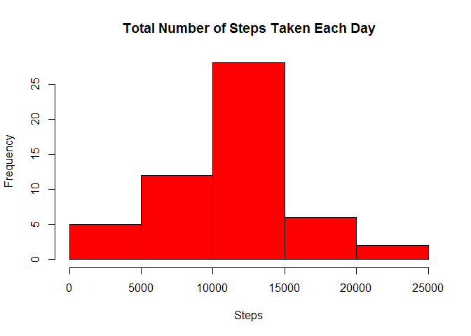
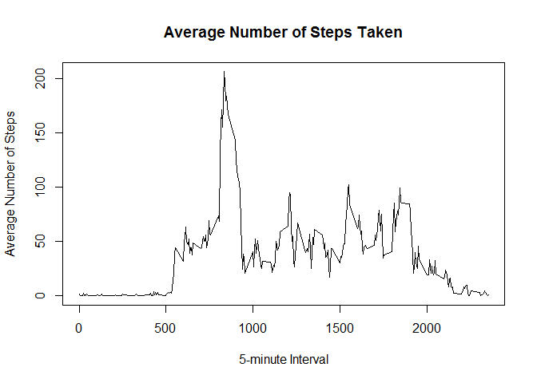

# Reproducible Research: Peer Assessment 1


```r
# loads all libraries used in the research
library(knitr)
# sets the option echo = TRUE for all the code chunks
opts_chunk$set(echo = TRUE)
```

## Loading and preprocessing the data


```r
## 1. Load the data (i.e. read.csv())
# temporary unzip activity.zip archive
temp <- unzip("activity.zip")
# reads the dataset with read.csv function
data <- read.csv(temp)
# removes the temporary .csv file
unlink(temp)

## 2. Process/transform the data (if necessary) into a format suitable for your analysis
# transforms date values from Factor to Date
data$date <- as.Date(as.character(data$date)) 

## (3.) Sample
# here's a preview of the data dataframe
head(data)
```

```
##   steps       date interval
## 1    NA 2012-10-01        0
## 2    NA 2012-10-01        5
## 3    NA 2012-10-01       10
## 4    NA 2012-10-01       15
## 5    NA 2012-10-01       20
## 6    NA 2012-10-01       25
```

## What is mean total number of steps taken per day?


```r
## 1. Calculate the total number of steps taken per day
# calculates the total number of steps per day
tot_steps_per_day <- aggregate(data$step, by=list(data$date), FUN=sum)
# changes the Group.1 variable name to step
colnames(tot_steps_per_day) <- c("date", "steps")

## 2. If you do not understand the difference between a histogram and a barplot, research the difference between them. Make a histogram of the total number of steps taken each day
hist(tot_steps_per_day$steps, main = "Total Number of Steps Taken Each Day", xlab = "Steps", col = "red")
```

 

```r
## 3. Calculate and report the mean and median of the total number of steps taken per day
mean <- format(round(mean(tot_steps_per_day$steps, na.rm = T), 2), nsmall = 2)
median <- median(tot_steps_per_day$steps, na.rm = T)
```

### Total number of steps taken per day:

Mean: 10766.19

Median: 10765

## What is the average daily activity pattern?


```r
## 1. Make a time series plot (i.e. type = "l") of the 5-minute interval (x-axis) and the average number of steps taken, averaged across all days (y-axis)
# aggregates steps by interval, using the mean function, and creates the plot data
plot_data <- aggregate(data$step, by=list(data$interval), FUN="mean", na.rm = T)
# renames the two columns, so they can be more readable
colnames(plot_data) <- c("interval", "avg_steps")
# creates the required time series plot
with(plot_data, plot(interval, avg_steps, type = "l", main = "Average Number of Steps Taken", xlab = "5-minute Interval", ylab = "Average Number of Steps"))
```

 

```r
## 2. Which 5-minute interval, on average across all the days in the dataset, contains the maximum number of steps?
# finds out the row that has the max average steps
interval_row <- which.max(plot_data$avg_steps)
# gets the interval value for that observation
interval_max_steps <- plot_data[interval_row, ]$interval
```

Time interval that contains the max number of steps: 835


## Imputing missing values


```r
## 1. Calculate and report the total number of missing values in the dataset (i.e. the total number of rows with NAs)
sum(!complete.cases(data))
```

```
## [1] 2304
```

```r
## 2. Devise a strategy for filling in all of the missing values in the dataset. The strategy does not need to be sophisticated. For example, you could use the mean/median for that day, or the mean for that 5-minute interval, etc.
# first I need which variables are affected by missing values
na_cols <- cbind(sum(is.na(data$steps)), sum(is.na(data$date)), sum(is.na(data$interval)))
colnames(na_cols) <- c("steps", "date", "interval")
na_cols
```

```
##      steps date interval
## [1,]  2304    0        0
```

Only steps variable has NA values. I assume that when there is a NA value there wasn't any recording activity, so I can change NA to 0


```r
## 3. Create a new dataset that is equal to the original dataset but with the missing data filled in.
data_fill <- data
data_fill[!complete.cases(data_fill), ]$steps <- 0
head(data_fill)
```

```
##   steps       date interval
## 1     0 2012-10-01        0
## 2     0 2012-10-01        5
## 3     0 2012-10-01       10
## 4     0 2012-10-01       15
## 5     0 2012-10-01       20
## 6     0 2012-10-01       25
```

## Are there differences in activity patterns between weekdays and weekends?
